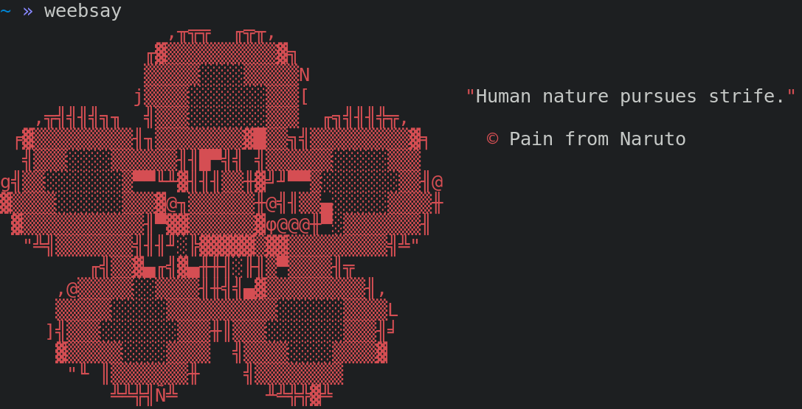

# 🎭👄 weebsay - cowsay but it's random anime quote
> 🌸 aesthetics inspired by [TorchedSammy](https://github.com/TorchedSammy) follow him he is a good guy
 


# Installation 🔨
```go get -u github.com/irevenko/weebsay``` <br>

# Usage 🔬
```weebsay``` or ```weebsay nocolor``` <br> 

# Contributing 🤝
Contributions, issues and feature requests are welcome! 👍 <br>
Feel free to check [open issues](https://github.com/irevenko/weebsay/issues).

# Show your support 🌟
Give a ⭐️ if this project helped you!

# Quick start 🚀
```git clone https://github.com/irevenko/weebsay.git``` <br>
```cd weebsay``` <br>
```go get -d ./...``` <br>
```go build``` <br>

# What i learned 🧠
- [Anime Chan API](https://github.com/rocktimsaikia/anime-chan)

# License 📑 
(c) 2021 Ilya Revenko. [MIT License](https://tldrlegal.com/license/mit-license)

